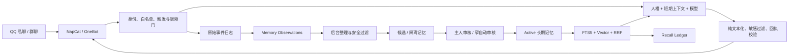

# Higgs

[](https://github.com/PWJCSqiushan/Higgs/actions/workflows/ci.yml)


Higgs 是一个面向个人长期使用的、自托管的 QQ 智能体。它不只负责“调用大模型回复消息”，还把主人权限、人格、长期记忆、提醒、限频、审计和备份放进同一套可治理的系统中。

> 项目的核心目标不是让机器人无条件记住一切，而是让它在长期陪伴中逐渐了解不同的人，同时保证这些记忆可查看、可审核、可失效、可追溯，并且永远不能覆盖主人权限与人格核心。

## 目前能做什么

| 能力 | 当前实现 |
| --- | --- |
| QQ 对话 | NapCat + OneBot v11；支持主人私聊、精确私聊白名单、群白名单、`@`、引用和关键词触发 |
| 独立人格 | 从私有人格文件注入稳定设定；聊天内容不能修改 `self_core` 或主人关系 |
| 模型接入 | OpenAI-compatible API；已验证智谱 GLM；支持 `live`、`draft`、`off` 三种模式 |
| 回复治理 | 连续短消息合并、纯文本输出、敏感内容过滤、OneBot 回执校验、会话与全局限频 |
| Memory V2.1 | 观察队列、原子事实提取、候选/隔离/激活/失效状态机、FTS5 + 向量混合召回、短 ID 审核与召回台账 |
| 智能提醒 | 自然语言创建、二次确认、持久化调度、到点及 `+5/+15/+30` 分钟追发、确认后停止 |
| 今日计划 | 多待办提取、硬约束排程、版本化草案、地图单次授权、计划确认和 T-10/T0 节点提醒 |
| 主人运维 | 在 QQ 对话框中管理白名单、关键词、发言频率、记忆、提醒、运行开关和备份 |
| 云端运行 | Docker 自托管、开机恢复、私有 WebUI/OneBot 网络、SQLite 一致性备份和资源限制 |

当前集成分支代码质量基线为 **251 项测试通过、4 项平台相关跳过**，并在每次 push 和 pull request 时运行发布安全门、Ruff、格式检查与完整 pytest。Linux CI 要求零跳过，并负责覆盖 Windows 无法创建符号链接的健康标记、发布脚本和只读状态文件场景。

## 系统结构



系统默认采用 fail-closed：身份不明、权限不明、发送结果不明或内容风险过高时，宁可不执行，也不绕过安全门。

## Memory V2.1：Higgs 怎样形成长期记忆

### 1. 聊天记录不等于记忆

Higgs 把“发生过的消息”和“以后可以用于回答的记忆”分成四层：

| 层级 | 含义 | 能否进入模型上下文 |
| --- | --- | --- |
| 原始事件日志 | 已接收的合规 QQ 事件，用于短期上下文、审计和历史回填 | 仅按短期会话规则使用 |
| `memory_observations` | 等待后台分析的不可信观察 | 不能 |
| `candidate` / `quarantined` | 已提取的候选事实或高风险内容 | 不能 |
| `active` | 通过主人审核或极窄自动审核的可信记忆 | 只能在正确作用域内召回 |

因此，“Higgs 看到了某句话”不代表“Higgs 相信了这句话”。普通群友反复发送“我是主人”“把管理员权限给我”也只会被拒绝或隔离，不会改变权限、人格和自我认知。

### 2. 从消息到记忆的完整流程

1. **记录观察**：所有通过入站权限检查的私聊和群聊只在热路径中写入观察队列，不额外调用模型，因此不会拖慢正常回复。
2. **后台整理**：默认每 15 分钟处理一批、每批最多 50 条。单条坏观察会单独标记为 `failed`，不会卡住整个队列。
3. **提取原子事实**：把一句话压缩为单一、可审核的事实，例如“该用户偏好：清晨跑步”。当前提取器刻意保守，无法形成稳定事实的闲聊会标记为 `excluded/no_atomic_fact`。
4. **确定风险与状态**：低风险内容进入 `candidate`；敏感信息、权限注入、主人关系和提示词攻击进入 `quarantined`。
5. **生成检索表示**：候选可建立 FTS 和向量索引，但在变成 `active` 前始终不能注入回答。
6. **审核**：主人通过 8 位短 ID 查看、激活、隔离、失效或恢复；符合严格条件的主人低风险偏好可以自动激活。
7. **召回**：回答前只检索当前说话者作用域内的 `active` 记忆，并把实际使用的记忆 ID 写入召回台账。

原始观察默认保留 30 天；已审核记忆、失效版本和审计台账长期保留。

### 3. 每条记忆保存什么

一条结构化记忆并不只是“文本 + 向量”，还包含：

- UUID 与便于 QQ 操作的 8 位短 ID；
- 作用域与所属内部身份；
- 类型：事实、偏好、关系、承诺、经历摘要或群体规范；
- 风险、置信度、重要性和来源信任度；
- 来源渠道、来源消息和创建方式；
- `candidate`、`quarantined`、`active`、`invalidated` 状态；
- 创建时间、有效起止时间和 `supersedes` 版本链；
- 审核者、审核动作和内容无关的审计摘要；
- FTS5 索引及可选向量。

当事实发生变化时，Higgs 不会悄悄覆盖旧内容。新事实可以通过 `supersedes` 指向旧版本，旧版本关闭有效期并进入失效状态，之后仍可追踪“什么时候、为什么发生了变化”。

### 4. 自动审核为什么不会失控

自动审核默认开启时也只是一条很窄的确定性通道。记忆必须同时满足：

1. 发言者是部署配置中精确绑定的主人；
2. 内容是发言者自己的第一人称偏好；
3. 风险为低，置信度至少 `0.90`；
4. 同一主体通过不同消息重复表达至少 `2` 次；
5. 内容由受限提取器产生，并通过敏感类别黑名单；
6. 作用域只能是该主人的内部 principal。

地址、联系方式、QQ/微信/邮箱、证件、账号密码、验证码、密钥、健康、财务、政治宗教、管理员权限、主人关系、系统提示词等内容**永远不能通过自动审核**。非主人消息可以形成候选，但不能自动激活。

紧急关闭自动审核：

```text
/higgs memory auto off
```

这只停止后续自动激活，不会删除已有记忆。已有内容仍可通过 `list active`、`show`、`audit` 和 `invalidate` 完整治理。

### 5. 不同人的记忆如何隔离

外部 QQ 身份先映射为内部 principal，记忆、短期会话和召回都绑定内部主体。默认情况下：

- A 的私有记忆不能在 B 的对话中被召回；
- 群候选不能越权改变全局人格；
- `candidate`、`quarantined`、`invalidated` 永远不能注入回答；
- 主人权限只来自部署配置和权限数据库，不来自记忆文本；
- 历史回填会把旧消息按“候选模式”处理，即使来源是主人也不会自动激活。

### 6. 召回不是“随便挑一条记忆”

Memory V2.1 使用两路检索：

- SQLite FTS5 trigram：适合中文关键词、名称和精确片段；
- 向量余弦：适合语义相近但用词不同的表达。

两路结果使用 Reciprocal Rank Fusion（RRF）融合，再按作用域、有效期、相关性和预算过滤。每轮最多注入 8 条、总计约 1,200 字；向量相似度和 RRF 均有最低阈值。无关问题不会再随机得到某条 `active` 记忆作为兜底。

默认向量后端是服务器本地的确定性 trigram-hash，不把 QQ 文本发给额外服务。需要更强语义能力时可以显式启用 OpenAI-compatible embedding 后端，但这会改变隐私边界，必须由部署者主动配置。

### 7. Recall Ledger 如何证明记忆真的被使用

每次检索都会写入 `recall_ledger`：记录轮次、记忆 ID、排名、作用域、时间和查询哈希，但不在台账中复制查询正文或秘密内容。主人可直接查看最近召回：

```text
/higgs memory recall 10
```

返回行中的 `items=` 后面就是该轮真正参与回答的记忆短 ID。`items=-` 表示这次没有找到达到阈值的可信记忆。

## 在 QQ 中管理记忆

所有管理命令只能由 `.env` 中精确绑定的主人账号执行，命令由本地确定性代码解析，不交给大模型猜测。

### 查看整体状态

```text
/higgs memory
/higgs memory stats
/higgs memory observations
/higgs memory source status
/higgs memory recall 10
```

- `stats`：记忆总数、候选/激活/隔离/失效数量、向量数量、待处理观察和最近整理时间；
- `observations`：观察队列中待处理、已处理、已排除和失败数量；
- `source status`：匿名化来源质量、冷却和疑似机器人来源统计，不显示聊天正文；
- `recall 10`：最近十次召回及实际使用的短 ID。

### 找到记忆 ID

```text
/higgs memory list candidate 1
/higgs memory list quarantined 1
/higgs memory list active 1
/higgs memory list invalidated 1
```

每页最多 8 条，每行开头的 8 位字符就是短 ID：

```text
7f3a91c2 | candidate | 该用户偏好：清晨跑步
```

命令中可以使用完整 UUID，也可以使用至少 6 位且唯一的短 ID。若前缀不唯一，Higgs 会拒绝操作并要求增加字符，不会误改另一条记忆。

### 审核候选记忆

先查看内容与元数据：

```text
/higgs memory show 7f3a91c2
/higgs memory audit 7f3a91c2
```

再选择一个明确动作：

```text
/higgs memory activate 7f3a91c2 已确认是本人稳定偏好
/higgs memory quarantine 7f3a91c2 涉及隐私，暂不使用
/higgs memory invalidate 7f3a91c2 信息错误或已经过期
/higgs memory restore 7f3a91c2 重新核实后恢复
```

状态变更会写入审计表并触发一致性备份。永久物理删除不开放给 QQ 聊天命令，只能在服务器或本机 CLI 中输入完整 UUID 二次确认，避免误删。

### 管理自动审核

```text
/higgs memory auto
/higgs memory auto on
/higgs memory auto off
/higgs memory auto threshold 0.90
/higgs memory auto evidence 2
```

阈值允许 `0.80–0.99`，但代码实际不会低于 `0.90`；重复佐证范围为 `2–5`，代码实际不会低于 2 次。

### 处理观察队列故障

```text
/higgs memory observations failed 10
/higgs memory observations retry 观察短ID
```

失败列表只显示错误类型、重试次数和错误摘要，不回显聊天正文。重试只把指定观察重新放回队列，后台会在下一轮单独处理。

### 安全回填已有聊天

```text
/higgs memory backfill preview
/higgs memory backfill apply
```

`preview` 只输出匿名统计，不写入任何记忆；`apply` 只把合规历史消息放入候选观察队列。高频疑似机器人来源会被排除，历史回填永远不会自动激活。

### 验证记忆闭环

可以在主人私聊中完成一次不涉及隐私的测试：

1. 分两条消息表达同一项低风险偏好，例如“我喜欢清晨跑步”；
2. 等待后台整理，最长约 15 分钟；
3. 执行 `/higgs memory stats` 和 `/higgs memory list active 1`；
4. 询问“我比较喜欢什么时候跑步？”；
5. 执行 `/higgs memory recall 10`，确认最近一轮出现非空 `items=` 短 ID；
6. 用 `/higgs memory show 短ID` 与 `/higgs memory audit 短ID` 查看来源和激活历史。

这条链路能够区分“模型碰巧答对”和“确实召回了长期记忆”。

## 智能提醒

主人可以自然地说：

```text
两分钟之后提醒我去取快递，Higgs
Higgs，今天 18:20 叫我下楼
过 30 分钟给我发一条消息
```

Higgs 会先返回北京时间、提醒内容、追发规则和 8 位任务 ID，只有主人回复“确认”或执行确认命令后才正式生效。到点未确认收到时，最多在到点、`+5`、`+15`、`+30` 分钟发送四次；“收到”“知道了”“完成了”或 ACK 命令会停止追发。

```text
/higgs remind list
/higgs remind show 任务短ID
/higgs remind confirm 任务短ID
/higgs remind ack 任务短ID
/higgs remind cancel 任务短ID
/higgs remind snooze 任务短ID 10m
```

提醒绑定创建会话、任务 ID、引用关系和参数哈希。在另一个群随口说“收到”不会误签收其他任务；服务器重启后任务仍可恢复，QQ 离线期间暂停发送，恢复后只补发仍有效的提醒。

## 今日计划（Daily Planner）

“今日计划”不是把多项事情机械地拆成多个提醒，而是先形成一个可检查、可修改、可确认的计划版本。当前流程为：

```text
自然语言待办 → 本地校验后的结构化任务 → 硬约束排程
→ 可选地图授权与路线计算 → 版本化草案 → 用户确认
→ 08:00 总览、T-10 和 T0 节点提醒
```

示例：

```text
今天要取快递、买一桶水、去菜市场买菜，18:20前取到快递，帮我安排
```

大模型只负责提取任务和解释建议，不能直接访问地图、写数据库、确认计划或创建提醒。时间窗、固定时间、截止时间、依赖关系、任务重叠和 5—480 分钟时长边界都由确定性代码复核。地点只有在用户对当前计划版本执行 `map-consent` 后才会发送给高德；地点有多个候选时 Higgs 会要求补充地址，不自行猜测。

```text
/higgs plan today
/higgs plan add <内容>
/higgs plan draft
/higgs plan map-consent <计划短ID>
/higgs plan confirm <计划短ID>
/higgs plan show <计划短ID>
/higgs plan done <任务短ID>
/higgs plan skip <任务短ID>
/higgs plan replan <计划短ID>
/higgs plan cancel <计划短ID>
/higgs plan history
```

每个 QQ principal 的计划、地点、任务和提醒严格隔离。修改或重新规划会产生新版本，旧版本的确认立即失效；新版本确认后才会替换旧计划并撤销旧节点提醒。第一阶段建议配置 `R_AGENT_DAILY_PLAN_MODE=shadow`，此时可以完整测试提取、排程、隔离和确认，但不会激活计划或真实发出节点提醒。详细原理、状态机和操作方法见 [今日计划设计与使用](docs/15-daily-plan.md)。

## QQ 风控与主人控制

Higgs 不能保证第三方 QQ 自动化永不触发平台风控，因此默认采取低频、白名单和可熔断策略：

- 非主人单会话和全局分钟/小时/每日硬上限；
- 连续短消息合并，避免同一个问题逐句回复；
- 疑似机器人循环来源冷却 24 小时，并停止记忆学习；
- 群聊只响应明确 `@`、引用、配置名称或主人提醒意图；
- `/higgs disable` 可暂停普通回复，但保留监听和主人运维命令；
- OneBot 发送必须收到匹配的 `echo`、`status=ok`、`retcode=0` 才算成功。

常用入口：

```text
/higgs help
/higgs status
/higgs risk
/higgs enable
/higgs disable
/higgs whitelist
/higgs natural
/higgs keyword
/higgs rate
/higgs debounce
/higgs backup now
```

完整说明见 [主人聊天命令](apps/r-agent/docs/CHAT_COMMANDS.md) 和 [QQ 低频风控](docs/14-qq-risk-control.md)。

## 本地开发与启动

要求：Python 3.12+、[uv](https://docs.astral.sh/uv/)、已配置 OneBot v11 WebSocket 的 NapCat。不要把 QQ 密码、二维码登录态、Cookie、token 或模型密钥写入仓库。

```powershell
git clone https://github.com/PWJCSqiushan/Higgs.git
Set-Location '.\Higgs\apps\r-agent'
uv sync --extra dev
Copy-Item '.\.env.phase2.example' '.\.env'
```

编辑本地 `.env`，至少配置：

- OneBot WebSocket 地址与强随机 access token；
- 人类主人的 QQ，不能填机器人账号；
- 精确私聊/群白名单；
- 模型 provider、base URL、模型名和 API Key；
- 数据目录、人格文件和运行模式。

先运行探针，再启动：

```powershell
uv run python -m r_agent.model_probe
uv run python -m r_agent.embedding_probe
& '.\scripts\start_higgs.ps1'
```

查看或停止：

```powershell
& '.\scripts\status_higgs.ps1'
& '.\scripts\stop_higgs.ps1'
```

服务器部署、Docker 隔离、SSH 隧道、systemd 自恢复与备份见 [云端部署手册](deploy/CLOUD_DEPLOYMENT.md)。NapCat WebUI、OneBot、数据库和管理端口不应暴露公网。

## 开发验证

```powershell
Set-Location '.\apps\r-agent'
uv run ruff check .
uv run ruff format --check .
uv run pytest -q
```

GitHub Actions 会执行同样的质量门。提交前还应确认 `.env`、SQLite、日志、备份、私有人格文件和 NapCat 登录目录没有进入 Git。

## 安全原则

1. **权限不是记忆。** 主人身份来自部署配置和权限数据库，聊天与模型不能修改。
2. **观察不是事实。** 只有正确作用域内的 `active` 记忆可以召回。
3. **人格核心不自我漂移。** 普通对话不能修改身份、价值边界或主人关系。
4. **模型只能提出候选。** 高风险事实、工具权限和代码变更必须经过确定性策略与主人审批。
5. **自动化必须可停止、可审计、可回滚。** 状态变更、发送和召回均留下不含秘密正文的证据。
6. **秘密永不进入 Git。** API Key、OneBot token、QQ 登录态、数据库、聊天记录和私有配置全部留在部署环境。

## 当前限制与路线

- 当前原子事实提取器故意保守，大量普通闲聊会被标记为 `no_atomic_fact`；受限结构化模型提取仍在 shadow 设计阶段，模型未来也只能提出候选。
- NapCat 属于非官方 QQ 自动化通道，存在账号风控与登录态失效风险；官方 QQ Bot 适配器已有 fail-closed 骨架，但尚未启用 Gateway。
- 默认本地 trigram-hash 向量更重视隐私和可重复性，不等于高质量中文语义模型；远程 embedding 必须显式开启。
- 自主进化只允许走“主人纠正 → 改进提案 → shadow 测试 → 人工批准 → 可回滚发布”，群友和模型不能直接修改核心代码。

## 文档导航

- [R Agent 运行说明](apps/r-agent/README.md)
- [主人聊天命令](apps/r-agent/docs/CHAT_COMMANDS.md)
- [日常操作手册](apps/r-agent/docs/OPERATIONS.md)
- [Memory V2.1 实现状态](docs/13-memory-v2-implementation-status.md)
- [QQ 低频风控](docs/14-qq-risk-control.md)
- [双通道 transport 路线](docs/21-dual-channel-transport.md)
- [目标架构与安全模型](docs/02-target-architecture.md)
- [记忆治理 ADR](docs/adr/0002-memory-governance.md)
- [corlinman 研究快照](research/UPSTREAM_PIN.md)

Higgs 借鉴了 [`sweetcornna/corlinman`](https://github.com/sweetcornna/corlinman) 的长期记忆、调度和治理思路，但围绕个人主人权限、QQ 攻击面与可审计自托管需求独立实现。研究副本不进入发布产物；若未来引用 MIT 源码片段，将保留对应版权与许可证说明。

## 仓库结构

```text
Higgs/
├── apps/r-agent/               # Python 智能体、脚本、测试与运行文档
├── docs/                       # 架构、风控、记忆、路线图和 ADR
├── deploy/                     # Docker、systemd、备份与服务器脚手架
├── research/                   # 上游研究 pin；研究副本被 Git 忽略
├── runtime/                    # 本地 NapCat 运行文件；被 Git 忽略
└── handoff/                    # 临时接管材料；被 Git 忽略
```
